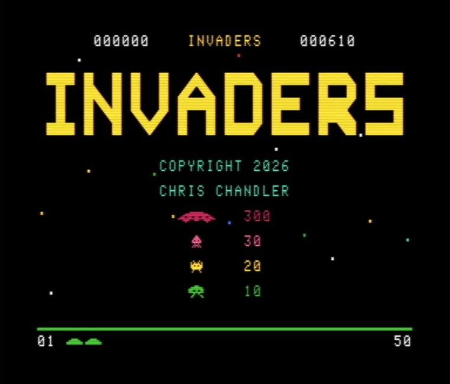
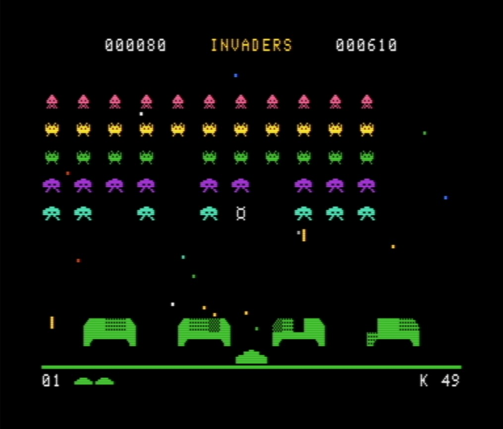

# C64 Invaders Game
**A full-featured Space Invaders inspired game for the Commodore 64, written in C using the Oscar64 compiler.**

## Overview
This project is a Space Invaders inspired game built for the Commodore 64 in C, compiled using the [Oscar64 compiler](https://github.com/drmortalwombat/oscar64).

The game runs on:
* Real Commodore 64 hardware or FPGA C64 emulators
* [VICE](https://vice-emu.sourceforge.io/) or other C64 emulators

## Screenshots

## Features

### Controls
* Joystick in \*\*Port 2\*\*
* Keyboard controls using \*\*A / D\*\*
* Joystick button or space bar to fire weapon

### Gameplay
* Alien swarm attacks planet
* Aliens kill player by collision or a bomb launched during attack
* Player protects planet with missile launches
* Destructible player bases provide cover
* Alien speed increases as swarm size decreases
* Game ends when aliens reach ground or all reserve players are lost

### Display \& HUD
* Current Score
* High Score
* Level #
* Reserve Player Ships

## Build \& Run

### Requirements
* Oscar64 compiler - https://github.com/drmortalwombat/oscar64
* A C64 emulator (recommended: VICE) or real hardware

### Build Steps
* from the command line "make.bat"

## Play Online
[Play Invaders online running in Vice.js](https://www.cehost.com/invaders/)
